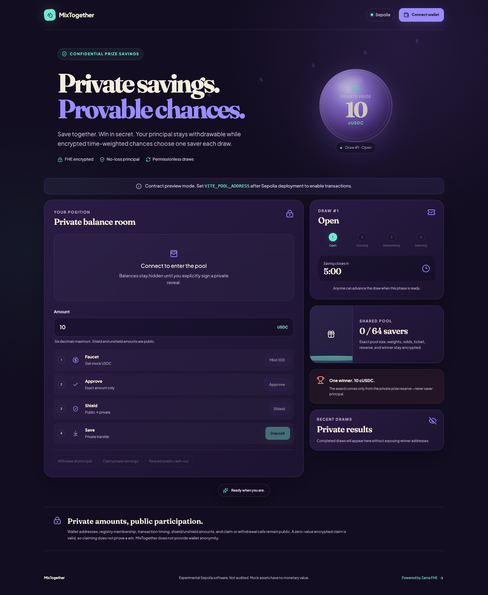
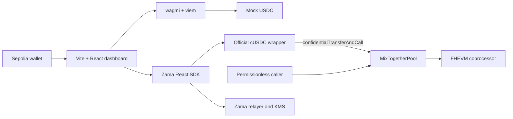

# MixTogether

**Private savings. Provable chances.**

MixTogether is a confidential prize-savings pool for Ethereum Sepolia. Savers keep their principal withdrawable while Zama FHE encrypts balances, time-weighted chances, randomness, the prize reserve, the selected interval, and winnings.

> **Experimental and unaudited.** MixTogether uses mock testnet assets, has no monetary value, and is not ready for production deposits. FHE hides amounts and draw outcomes; it does not hide wallet participation or transaction timing.

[Open the Vercel preview](https://web-5wg8kthck-gadillacers-projects.vercel.app) · [Read the architecture](docs/architecture.md) · [Review security assumptions](SECURITY.md)

The public preview intentionally runs with transactions disabled until a funded Sepolia deployment address is configured.



## How it works

1. Mint mock USDC from the official Sepolia faucet contract.
2. Approve the exact public amount and wrap it into confidential cUSDC.
3. Transfer cUSDC into the pool without revealing the deposit amount.
4. Earn encrypted ticket weight from quantized principal times eligible seconds.
5. Let any wallet advance the bounded draw in eight-saver batches.
6. Explicitly sign an EIP-712 permit to reveal only your cUSDC, principal, and winnings in the browser.
7. Claim winnings, withdraw principal at any draw phase, or request an asynchronous public unwrap.

One completed draw awards up to 10 cUSDC from the separate prize reserve. Principal never funds prizes.

## Fixed v1 parameters

| Parameter | Value |
| --- | --- |
| Chain | Ethereum Sepolia (`11155111`) |
| Epoch | 5 minutes |
| Winner | 1 per completed draw |
| Nominal prize | 10 cUSDC |
| Saver capacity | 64 registered wallets |
| Batch size | 8 occupied slots |
| Ticket unit | 0.1 cUSDC-second |
| Weight | `floor(principal / 100_000) × eligibleSeconds` |

Official Sepolia token pair, revalidated on 2026-09-05:

- cUSDC: [`0x7c5B…3639`](https://sepolia.etherscan.io/address/0x7c5BF43B851c1dff1a4feE8dB225b87f2C223639)
- Mock USDC: [`0x9b5C…DfF`](https://sepolia.etherscan.io/address/0x9b5Cd13b8eFbB58Dc25A05CF411D8056058aDFfF)
- Wrapper registry: [`0x2f07…128e`](https://sepolia.etherscan.io/address/0x2f0750Bbb0A246059d80e94c454586a7F27a128e)

Validation confirmed deployed code, six decimals, a 1:1 wrapper rate, the underlying relationship, both registry directions, registry validity, and a permissionless static faucet mint.

## Architecture



The non-upgradeable pool partitions encrypted liabilities:

```text
pool cUSDC balance >= aggregate principal + prize reserve + unclaimed winnings
```

`OPEN → ACCRUE → RANDOMIZE → SELECT → OPEN` is permissionless. Accrual and selection process at most eight occupied slots per transaction. Selection conditionally credits one encrypted interval while refreshing every visited saver’s winnings handle so storage activity does not reveal the winner.

## Privacy boundary

| Encrypted | Public |
| --- | --- |
| cUSDC balance and pool principal | Participating wallet addresses |
| Saver weights, total weight, and exact pool size | Registry occupancy and draw progress |
| Odds, random word, ticket, and selected interval | Transaction timing and callers |
| Prize reserve and winnings | Nominal 10 cUSDC award |
| Winner result | Shield and unshield amounts |

A zero-value encrypted claim is valid. A claim transaction is therefore not cryptographic proof of a win, though timing correlations remain possible. Shielding and unshielding cross a public boundary, and MixTogether does not provide wallet anonymity.

## Repository

```text
apps/web/              Vite React dashboard, unit tests, Playwright tests
packages/contracts/    Hardhat V2 FHEVM contract, tests, deployer, keeper
docs/ai/               Requirements, design, implementation, test, release records
docs/                   Architecture and submission collateral
output/playwright/      Reviewed desktop and mobile screenshots
```

## Local development

Requirements: Node.js 22+, pnpm 8.15.9, and a browser wallet configured for Sepolia.

```bash
pnpm install --frozen-lockfile
pnpm check
pnpm build
pnpm dev
```

Copy `.env.example` to `.env` for browser-safe public configuration. Never put private keys in `VITE_*` variables. Without `VITE_POOL_ADDRESS`, the app enters a safe preview mode and disables all transactions.

Run browser tests after installing the pinned browser once:

```bash
pnpm --filter @mixtogether/web exec playwright install chromium
pnpm test:e2e
```

## Sepolia validation and deployment

Hardhat secrets use its encrypted variable store rather than committed files:

```bash
cd packages/contracts
pnpm exec hardhat vars set DEPLOYER_PRIVATE_KEY
pnpm exec hardhat vars set SEPOLIA_RPC_URL
pnpm exec hardhat vars set ETHERSCAN_API_KEY
pnpm validate:sepolia
pnpm deploy:sepolia
```

`GUARDIAN_ADDRESS` may be supplied as a server-side environment variable; otherwise the deployer becomes guardian. The deploy script re-runs token validation, writes `deployments/sepolia/MixTogetherPool.json`, and verifies on Etherscan when an API key is available.

After deployment, set `VITE_POOL_ADDRESS`, rebuild the web app, fund the reserve through cUSDC `confidentialTransferAndCall` with `abi.encode(uint8(2))`, and complete the two-wallet/eight-saver smoke checklist before treating the demo as transaction-ready.

Run one keeper step or watch continuously:

```bash
SEPOLIA_RPC_URL=… POOL_ADDRESS=… KEEPER_PRIVATE_KEY=… pnpm keeper
SEPOLIA_RPC_URL=… POOL_ADDRESS=… KEEPER_PRIVATE_KEY=… pnpm keeper -- --watch
```

## Verification status

- Contract state-machine, callback, ACL, withdrawal, prize, selection, pruning, guardian rotation, and eight-saver batch tests pass locally.
- Web domain tests and four desktop/mobile Playwright checks pass.
- TypeScript checks, Solidity compilation, and the production Vite build pass.
- The production dependency audit reports no known vulnerabilities; pinned Hardhat/Zama development tooling retains documented transitive advisories.
- The Vercel preview is live with COOP `same-origin` and COEP `require-corp`.
- Sepolia token validation passes; pool deployment is pending a funded, non-test deployer.
- GitHub publication is pending renewed `gh` authentication.

See [the submission checklist](docs/submission-checklist.md) for the exact release blockers and [the demo script](docs/demo-video-script.md) for a sub-three-minute walkthrough.

## License

[MIT](LICENSE)
