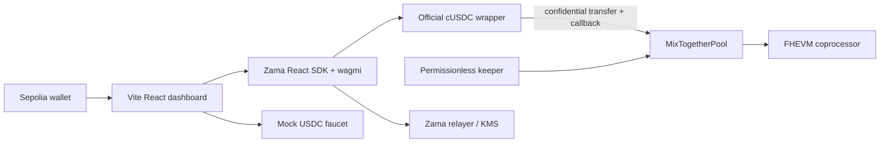

# MixTogether system design

## Architecture



The repository is a pnpm workspace. `packages/contracts` contains the Hardhat V2 FHEVM project and generated ABI. `apps/web` contains a client-only Vite React application. No backend or database is introduced.

## Contract model

`MixTogetherPool` inherits `ZamaEthereumConfig`, `IERC7984Receiver`, `ReentrancyGuard`, and `Ownable2Step`. Plaintext storage tracks addresses, slots, timestamps, draw identifiers, cursors, and phases. Encrypted storage tracks principal, balance-seconds, draw weights, aggregate liabilities, reserve, award, random ticket, cumulative selection weight, per-user winnings, and whether a winner has been credited.

At each encrypted state mutation the new handle is persisted with `FHE.allowThis`; user-owned principal/winnings handles additionally receive `FHE.allow(..., user)`. Transfers grant the cUSDC contract transient access to the requested handle and account using the returned actual transfer where applicable.

The liability partition is:

```text
cUSDC pool balance >= aggregate principal + prize reserve + unclaimed winnings
```

Deposits increase principal only. Prize callbacks increase reserve only. Randomization moves `min(reserve, 10 cUSDC)` from reserve to the active award. Selection moves that award to exactly one winnings ledger or restores it.

## Draw state machine

- `OPEN`: deposits accrue the user's previous balance through the current timestamp; withdrawal accrues before zeroing principal. `closeDraw` fixes the cutoff after five minutes.
- `ACCRUE`: batches finalize up to eight occupied slots through the cutoff and quantize weight. Exits and claims remain enabled.
- `RANDOMIZE`: one encrypted 64-bit random value is scaled into `[0,totalWeight)` with an encrypted 128-bit product and a right shift of 64. The award is reserved first.
- `SELECT`: batches accumulate weights and encrypted-conditionally credit each saver. Every visited active winnings ledger gets a fresh handle. Finalization restores an unused award, resets draw-local accumulators, increments the draw id, and starts a new epoch.

Exited slots remain stable until selection finishes. `pruneExited` reclaims at most eight requested slots only while `OPEN` and only when both principal and accrued state are known-by-construction to have been reset.

## Client design

The app has one responsive dashboard organized around an orb-like prize header, three deliberately blurred private-balance cards, an adaptive action panel, draw progress, and confidential history. Reads use wagmi. SDK configuration uses the React wagmi adapter, the Sepolia preset, distinct IndexedDB stores for SDK state and scoped permits, and explicit permit acquisition. Wallet/chain changes clear locally decrypted values.

Transactions use a receipt-backed step model with explorer links and retryable failure states. Pending unwrap identifiers are stored by chain, wrapper, and wallet and rediscovered from wrapper events after reload.

## Visual direction

Direction: playful-premium confidential savings dashboard. Density: comfortable. Surface: violet rounded panels over midnight plum. Type mood: editorial, warm, precise. Motion: slow buoyant springs with reduced-motion fallbacks. Use cream text, a single violet focus accent, aqua only for success, coral only for warning, and a luminous prize orb. Avoid casino urgency, flashing, fake odds, glass-card repetition, and gradients on body copy.

## Security and failure handling

- Reject wrong token callbacks, malformed modes, wrong chain, unsupported token pairs, full registry deposits, premature/stale phase calls, and deposits while paused/closed.
- Zero encrypted transfers are valid and never inferred as plaintext failure.
- The app distinguishes rejected signatures, reverted transactions, relayer outages, insufficient public USDC, missing approval, confidential zero transfers, and pending asynchronous unshield.
- No secret keys enter Vite variables. Deployment keys live only in Hardhat secret configuration.

## Design trade-offs

The bounded registry and fixed batches trade capacity for predictable FHE cost. Public participation metadata is accepted because FHE protects amounts and outcomes, not wallet anonymity. The random-range multiply has negligible modulo bias and avoids encrypted division. A confidential mock reserve replaces strategy yield in v1 without weakening principal segregation.
