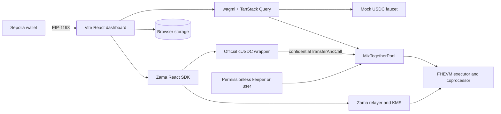
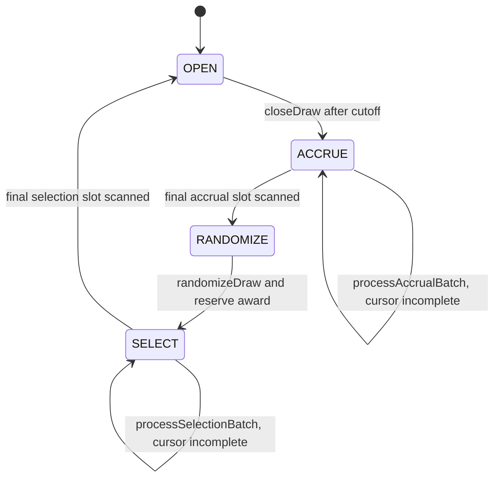

# MixTogether system design

## Architecture and trust boundaries



The repository is a pnpm workspace. `packages/contracts` contains the Hardhat V2 FHEVM project, deploy/preflight/keeper scripts, tests, and exported ABI. `apps/web` is a client-only Vite React application. There is no MixTogether backend, indexer, database, privileged keeper, or upgrade proxy.

The user's wallet is the only transaction signer. The Zama relayer, KMS, FHEVM executor, and coprocessor are protocol dependencies: they process ciphertexts and authorized user-decryption requests but are not application custodians. Public Sepolia RPC responses, events, registry membership, and timing are untrusted public inputs. Contract authorization and encrypted ACLs are the security boundary.

The application supports only chain `11155111`, the official cUSDC mock at `0x7c5BF43B851c1dff1a4feE8dB225b87f2C223639`, its six-decimal underlying at `0x9b5Cd13b8eFbB58Dc25A05CF411D8056058aDFfF`, and the Sepolia wrapper registry at `0x2f0750Bbb0A246059d80e94c454586a7F27a128e`. Deployment preflight revalidates code, decimals, the underlying relationship, one-to-one rate, registry entry, and permissionless faucet behavior instead of trusting committed addresses alone.

## Contract components

`MixTogetherPool` inherits `ZamaEthereumConfig`, `IERC7984Receiver`, `ReentrancyGuard`, and `Ownable2Step`.

| Component | Responsibility |
| --- | --- |
| Authenticated receiver | Accept actual encrypted cUSDC transfers only from the configured wrapper and route `DEPOSIT = 1` or `PRIZE = 2` callbacks. |
| Saver registry | Hold at most 64 public wallet slots, stable for the lifetime of an active draw. |
| Accrual engine | Convert encrypted principal into `floor(principal / 100_000) * eligibleSeconds` using `euint64` values and public scalar time. |
| Draw engine | Advance one permissionless draw through `OPEN`, `ACCRUE`, `RANDOMIZE`, and `SELECT` in resumable eight-saver batches. |
| Liability ledgers | Keep aggregate principal, prize reserve, and aggregate unclaimed winnings in separate encrypted state. |
| Guardian control | Pause only new deposits, diagnose only the current reserve, and transfer that narrow role in two steps. |

The fixed epoch duration, nominal award, registry size, batch size, and ticket unit are compile-time constants. A faulty deployment is replaced with a new immutable pool rather than upgraded in place.

The receiver callback is atomic with the ERC-7984 transfer. It requires `msg.sender` to equal the configured cUSDC contract, requires an exact ABI word (`data.length == 32`), decodes only `DEPOSIT = 1` or `PRIZE = 2`, and credits the callback's actual encrypted `amount`, never a requested amount supplied elsewhere. Malformed or unsupported callbacks revert the entire transfer-and-call. A valid callback returns encrypted `true` after granting that result transiently to cUSDC, as required by the token receiver interface.

## Data model and ACL ownership

| State | Visibility / ACL | Lifetime |
| --- | --- | --- |
| Saver address, one-based slot, saver count | Public | Until a qualifying prune |
| Draw id, phase, timestamps, cursors | Public | Current draw / cumulative id |
| Principal, balance-seconds, last-accrual time | Contract plus owning saver; timestamp is public | Per saver |
| Frozen draw weight and plaintext weight draw marker | Contract plus owning saver; marker is control metadata | Latest recorded draw |
| Aggregate principal and winnings | Contract only | Pool lifetime |
| Prize reserve | Contract plus current guardian | Pool lifetime, rotated on guardian transfer |
| Random ticket, cumulative weight, active award, winner flag | Contract only | Current draw |
| Winnings | Contract plus owning saver | Until claimed |
| Exit requested and exit draw id | Public control metadata | Until redeposit or prune |

Every stored FHE result receives `FHE.allowThis`. User-owned handles also receive `FHE.allow(handle, user)`. A cUSDC transfer receives only `FHE.allowTransient(requested, token)`; no persistent token permission is granted. Getters may return opaque handles publicly, but the KMS rejects decryption without the corresponding ACL permission.

The reserve getter is publicly callable because the returned handle is not the plaintext. Only the current guardian receives ACL permission for the current handle. On two-step ownership acceptance, the pool homomorphically adds encrypted zero to create a fresh reserve handle and grants it to the incoming guardian. FHE ACL grants on an old handle cannot be revoked, so a former guardian may retain a historical snapshot but cannot decrypt subsequent reserve state.

## Liability accounting

The core invariant is:

```text
cUSDC balance of pool >= aggregate principal + prize reserve + unclaimed winnings
```

Deposits increase principal only. Prize callbacks increase reserve only. `randomizeDraw` atomically moves `min(reserve, 10 cUSDC)` from reserve into the active award before selection begins. Selection moves the active award to one winnings ledger; a zero-weight or unselected draw restores it to reserve. Claims and withdrawals subtract the actual encrypted amount returned by cUSDC from the matching user and aggregate ledger. Principal is never reclassified as prize capital.

All financial quantities use `euint64`; the maximum bounded five-minute, 64-saver score sum fits that range. `euint128` is used only for random-range multiplication, where the wider intermediate prevents overflow.

## Draw and exit state machine



- `OPEN`: deposits are accepted before the scheduled cutoff. A deposit first accrues the prior principal through the current timestamp. A withdrawal accrues through `min(now, scheduledCutoff)` before principal is reduced.
- `ACCRUE`: `closeDraw` freezes the scheduled cutoff. Each batch scans the registry and finalizes up to eight occupied savers. Recording a saver snapshots its frozen weight, stamps the plaintext weight draw marker, and zeroes its balance-seconds accumulator. A withdrawal records that saver once before returning principal.
- `RANDOMIZE`: the award is reserved, then `random = FHE.randEuint64()` is mapped to the encrypted weight interval as `uint64((uint128(random) * uint128(totalWeight)) >> 64)`. The public shift avoids unsupported encrypted division. The bounded mapping's bias is negligible and accepted for v1.
- `SELECT`: each batch visits up to eight occupied savers, updates the encrypted cumulative interval, and uses encrypted comparisons plus `FHE.select` to credit the first matching interval. Every visited winnings ledger is rewritten whether or not it wins. Finalization restores an unused award, clears aggregate draw-local state, increments the draw id, and starts a fresh five-minute epoch; processing time earns no weight.

The final selection transaction does not perform an unbounded second pass to reset all savers. Each accumulator was already cleared when its frozen weight was recorded. After finalization, accrual clamps every retained saver's effective start to the new global epoch start, and a stale weight draw marker makes the previous frozen weight ineligible until the saver is recorded for the new draw. Aggregate frozen weight, ticket, cumulative weight, active award, and interval-selection state are cleared at finalization. This lazy baseline rule prevents either the completed epoch or draw-processing time from being counted again while retaining the eight-slot bound.

Withdrawal and claim remain callable in every phase. An exit records `exitDrawId = current drawId`; redeposit cancels the exit. `pruneExited` is allowed only in `OPEN`, accepts at most eight slots, and may prune only when `current drawId > exitDrawId`. Therefore an `OPEN` withdrawal retains the weight earned before exit, and a post-cutoff withdrawal retains its frozen weight, until that draw's selection completes. Immediate pruning was rejected because a third party could otherwise erase earned eligibility before accrual.

## Public contract API

| API | Caller and behavior |
| --- | --- |
| `onConfidentialTransferReceived(operator, from, amount, data)` | Configured cUSDC only; returns an encrypted acceptance boolean with transient permission. |
| `withdrawAll()` | Any saver, every phase; transfers actual confidential principal and marks the exit draw. |
| `claimWinnings()` | Any wallet, every phase; a confidential zero claim is valid. |
| `closeDraw()` | Permissionless after the five-minute cutoff. |
| `processAccrualBatch()` | Permissionless in `ACCRUE`; resumes from the public cursor. |
| `randomizeDraw()` | Permissionless once all accrual slots are scanned. |
| `processSelectionBatch()` | Permissionless in `SELECT`; resumes from the public cursor and finalizes when complete. |
| `pruneExited(slots)` | Permissionless in `OPEN`; at most eight draw-complete exits. |
| `pauseDeposits()` / `unpauseDeposits()` | Current guardian only; affects no other operation. |
| Encrypted getters | Return opaque principal, winnings, weight, or reserve handles; ACL controls actual decryption. |
| Public getters | Return draw state, registry slots/count, exit metadata, pause state, constants, and token address. |

Events contain addresses, draw ids, phase progress, and cursors only. They never contain ciphertext handles or amount-like fields.

## Client architecture and user flows

The dashboard composes three boundaries:

- wagmi performs public reads and direct pool writes, enforces Sepolia, and supplies the EIP-1193 signer.
- The Zama React wagmi adapter handles cUSDC wrapping, confidential calls, permit acquisition, and authorized decryption.
- Pure local helpers format amounts, choose the valid draw action, normalize transaction results, and merge pending unshield requests. These helpers are unit-testable without a wallet or relayer.

The saver flow is faucet → exact ERC-20 approval → wrap/shield → confidential `transferAndCall` deposit → explicit reveal → draw advancement → reveal/claim → confidential withdrawal → optional public unshield. Separate approval and wrap transactions are intentional: the UI explains exact allowance and provides distinct receipts. Deposit remains a separate confidential callback so the wrapper's public shield amount and the pool's encrypted deposit amount are not conflated.

Private balance handles are read without prompting. Only the user's “Reveal my private balances” action enables the three-value decryption request. The SDK reuses a valid permit silently within the browser session and requests an EIP-712 signature only when needed. No reveal is initiated on connect, page load, polling, or draw completion.

SDK network/key material uses IndexedDB. Permit credentials use a separate `sessionStorage` adapter with `permitTTL: 1` day, so they cannot survive the browser session. Wallet address, chain, disconnect, or session changes unmount revealed values and evict Zama decryption/permit query data without clearing unrelated public reads.

The canonical Zama transaction result is `{ txHash, receipt }`; the UI normalizer accepts `txHash`, viem `hash`, and receipt `transactionHash` before building an explorer URL. Each action records awaiting-wallet, submitted, confirmed, or error state and offers an idempotent retry where safe.

Public unshielding uses the wrapper's asynchronous request/finalize flow. Local recovery state is namespaced by `(chainId, wrapper, wallet)`. It stores the phase-one transaction hash until the wrapper event yields a request id, then stores that id until a matching finalization event is observed. On reload the app replays only the bounded wrapper event range needed for that wallet, merges it with local state, and never persists a confidential balance or pool amount.

The application is entirely static. Vite variables contain only public chain, contract, RPC, and explorer configuration; deployer keys, Etherscan credentials, permit material, and other secrets are forbidden. The deployed app sends `Cross-Origin-Opener-Policy: same-origin` and `Cross-Origin-Embedder-Policy: require-corp`, which are verified in both the Vercel configuration and the live response.

## Interface composition

The single responsive dashboard contains:

- wallet/network and testnet safety state;
- a luminous nominal-prize orb, phase, and countdown;
- three blurred private cards that show em dashes until explicit reveal;
- adaptive faucet, approve, shield, deposit, reveal, claim, withdraw, and unshield actions;
- saver count, batch cursors, “Confidential outcome” history, and one contextual “Advance draw” action;
- a receipt-backed transaction status area with retries and Sepolia explorer links;
- mobile-safe sheets/stacking, visible focus, labeled controls, live regions, and reduced-motion fallbacks.

History rows contain only public draw and progress metadata. “Confidential outcome” deliberately asserts neither a winner nor a positive award: zero-weight or unselected draws have no selected interval, while a privately selected interval can still receive an encrypted zero award.

The visual direction is playful-premium confidential savings: midnight plum canvas, rounded violet surfaces, cream typography, aqua success, coral warnings, Fraunces display text, and Plus Jakarta Sans UI text. Motion is slow and savings-oriented. Confetti is local-only after decrypting a positive prize. The interface avoids urgency, flashing jackpots, fabricated odds, or winner claims.

## Failure and recovery model

| Failure | Recovery |
| --- | --- |
| Wrong wallet chain or missing provider | Disable writes, explain Sepolia, offer switch/connect. |
| Relayer/KMS/SDK outage | Preserve onchain state and revealed-value ambiguity; retry later. |
| Rejected signature or transaction | Return to an idle retryable step without claiming submission. |
| Missing allowance or public USDC | Direct the user to exact approval or faucet; never infer private balance. |
| Encrypted zero transfer | Accept it without plaintext branching; disclose possible slot consumption. |
| Full registry or closed/stale draw | Surface the contract state, refresh reads, and offer only the newly valid action. |
| Interrupted accrual/selection | Any account resumes from the public cursor. |
| Interrupted unshield | Rediscover the request id from events and retry finalization. |
| Live HCU or block-cap rejection | Do not claim advancement; retain the public cursor, surface the failed receipt, and block release until the fixed full batch succeeds on deployed Sepolia limits. |
| Faulty immutable deployment | Pause only new deposits, preserve exits/claims/draw liveness, and point the app to a replacement deployment. |

## HCU, performance, and availability

The currently published FHEVM transaction limits are 20 million total HCU and 5 million sequential-depth HCU, but deployed governance parameters and per-operation costs can change and a network may additionally enforce a block cap. Design choices therefore use `euint64`, public scalar operands where possible, one `euint128` multiply outside loops, and fixed eight-saver batches. Preflight records the deployed limits used for validation. The full occupied eight-slot accrual and selection calls—not empty-slot simulations—must pass on the currently deployed Sepolia protocol before release; failure blocks release rather than silently changing immutable batch semantics. The local FHE harness proves behavior, not live HCU compatibility.

There is no availability promise beyond Sepolia, the user's RPC/wallet, and Zama services. Permissionless resumability removes a single application keeper dependency. Public cursors and deterministic phase guards make duplicate or stale callers fail safely. The 64-slot registry is a computation bound, not Sybil resistance: coordinated wallets—and encrypted-zero deposits whose value the contract cannot branch on—can consume every slot until normal withdrawal and post-draw pruning reclaim them. The UI states this limitation and never presents remaining capacity as abuse-resistant.

## Decisions and rejected alternatives

- Official ERC-7984 cUSDC over a custom confidential token: preserves the official wrapper behavior and ecosystem balances. The pair has already passed requirements validation; if deployment preflight later fails, release is blocked and requirements are reopened rather than deploying a fallback asset under the same product configuration.
- Fixed 64-slot registry and eight-slot batches over unbounded iteration: bounds HCU and makes liveness resumable at the cost of capacity and multiple transactions.
- Delayed prune by exit draw over immediate `OPEN` pruning: preserves earned eligibility against third-party removal at the cost of holding a slot until finalization.
- Encrypted interval scan over public odds or offchain winner selection: keeps chances and outcome private while preserving onchain execution.
- “Confidential outcome” history over “Confidential winner” or public outcome decryption: remains truthful for zero-weight, unselected, and zero-award outcomes without adding a decryption/leakage path.
- Confidential reserve over principal-funded prizes or v1 strategy yield: keeps no-loss accounting auditable and limits strategy risk.
- Session-scoped permits over long-lived credentials: may require another signature after a browser session but narrows credential persistence.
- High-level Zama React SDK over custom low-level relayer integration: centralizes current permit, token, and transaction semantics.
- Injected wagmi connector over RainbowKit: keeps wagmi v3 compatibility with the current Zama adapter; richer connector UI can return when stable majors align.
- Client-only app over backend/indexer: removes custody and operational dependencies; bounded event recovery is acceptable for the demo scale.

## Release validation and rollback

Local gates cover contract behavior/invariants, pure client logic, accessibility, responsive/reduced-motion rendering, typecheck, lint, production build, and browser smoke tests. Release additionally requires a funded pool deployment, verified source/constructor arguments, 100 cUSDC reserve funding, full eight-slot live HCU receipts, cross-wallet ACL denial, a two-wallet end-to-end flow, and a transaction-enabled Vercel build with COOP/COEP headers.

The deployment manifest and exported ABI are committed only after verification. The preview remains transaction-disabled and `noindex` while no pool address is configured. Rollback changes only the web-configured address; it never migrates private liabilities automatically or grants the guardian withdrawal authority.

## Review outcome and implementation follow-ups

The design covers every approved goal, user workflow, privacy boundary, fixed rule, API, failure path, and rollout constraint. The review resolved the final product ambiguity by using “Confidential outcome,” hardened ERC-7984 callback and unwrap recovery boundaries, and aligned release behavior with the already validated official token pair. No architecture question remains open. Two implementation gaps were found during this review and are tracked in planning/testing before the next implementation sign-off:

1. record each exit's draw id and reject pruning until that draw has finalized;
2. recognize Zama SDK `TransactionResult.txHash` when producing explorer links.
