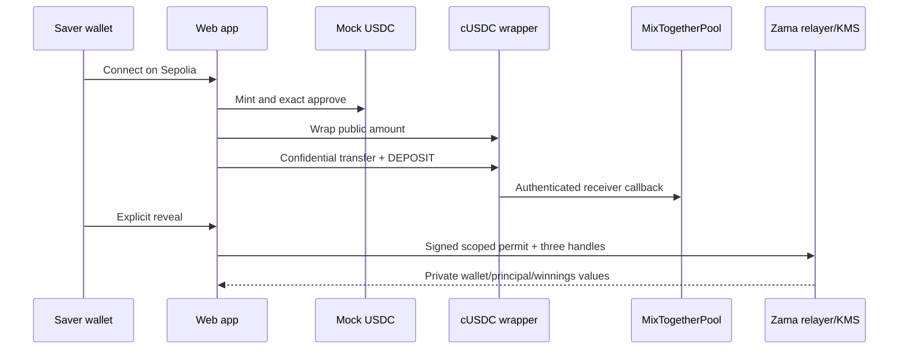
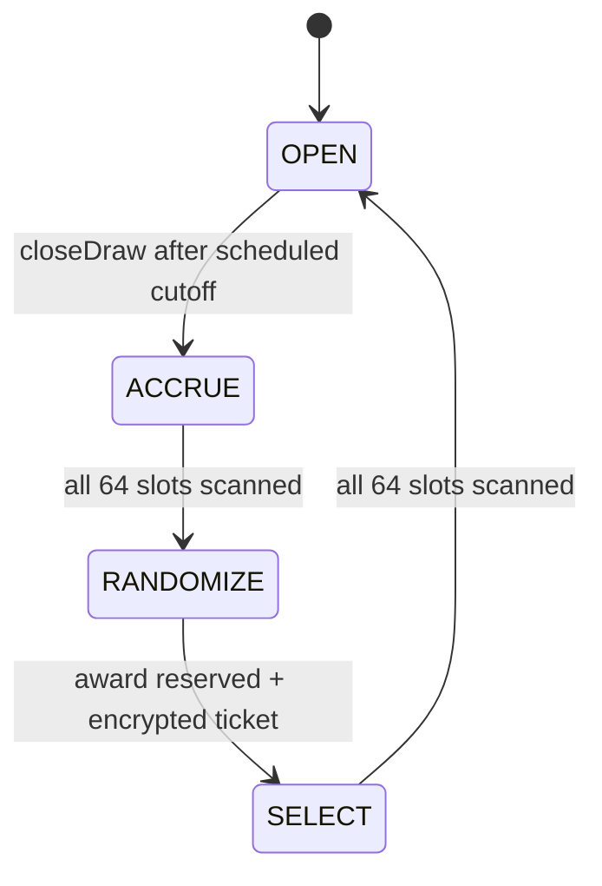

# MixTogether architecture

## Components

MixTogether has no application backend or database. The React client talks directly to Sepolia through wagmi and to Zama’s relayer/KMS through the Zama React SDK. A non-upgradeable `MixTogetherPool` holds the confidential cUSDC and encrypted accounting. Any funded address may run the keeper command or call the phase functions directly.



## Accounting

Deposits add only to encrypted principal. Prize funding adds only to encrypted reserve. `randomizeDraw` reserves `min(reserve, 10e6)` before selection. Selection moves the award to one encrypted winnings ledger or restores it when total weight is zero or no interval is selected.

The intended invariant is:

```text
confidentialToken.balanceOf(pool)
  >= aggregatePrincipal + prizeReserve + aggregateWinnings
```

Withdrawals and claims subtract the token’s returned actual transfer, preserving the ledger if the token returns an encrypted zero. With the authenticated stock cUSDC wrapper and the backing invariant, a registered saver’s full principal transfer succeeds; only then is its slot semantically eligible for pruning after the draw completes.

## Draw lifecycle



- During `OPEN`, balance-seconds accrue before each balance mutation.
- `ACCRUE` fixes weight at the scheduled cutoff in batches of eight occupied slots.
- `RANDOMIZE` multiplies an encrypted 64-bit random word by encrypted total weight in `euint128`, then shifts right 64 bits.
- `SELECT` scans encrypted cumulative intervals. Every visited saver receives a freshly written winnings handle regardless of whether its interval is selected.
- Processing time between cutoff and finalization earns no tickets. Post-cutoff withdrawals retain the weight already earned.

## ACL rules

Every stored encrypted value grants persistent access to the pool contract. Principal, accrued values, weights, and winnings also grant access to their owning saver where used by the client. Token transfers use transient access. Only the current guardian is granted the fresh current reserve handle. Events emit addresses and progress, never ciphertext handles or amounts.

## HCU posture

The implementation uses `euint64` for balances and weights, scalar operands where possible, and `euint128` only for random-range multiplication. Local FHEVM tests execute exactly eight occupied accrual slots and eight occupied selection slots in a single transaction under the configured HCU limits. The current protocol caps are 20M total HCU and 5M sequential-depth HCU per transaction; a real Sepolia smoke is still required because operation costs and network configuration can change.
